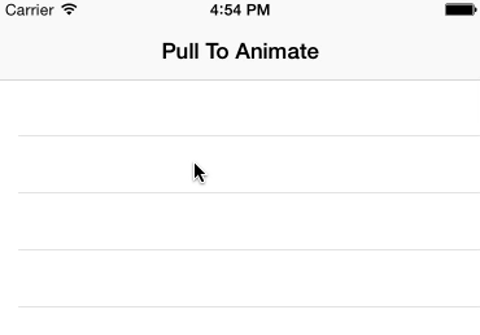
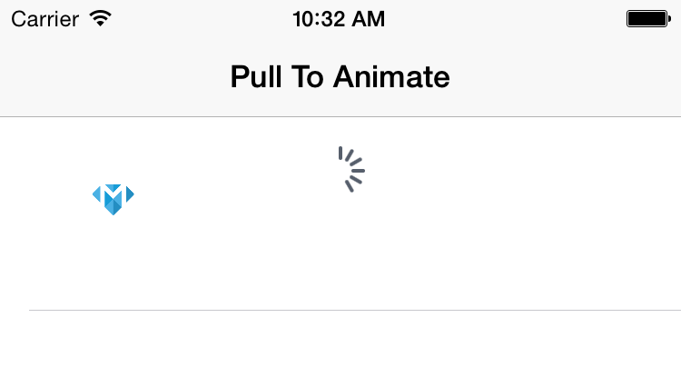
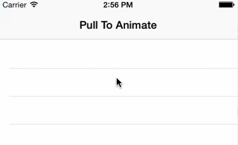

#How to Create Pull-To-Refresh Animations

In this tutorial, we will create a simple pull-to-refresh animation that is achieved with just a few lines of mathmatical funcations in Swift.

###Starter
We will start with a starter project that includes a `UITableView and a UIRefreshControl.

ADD URL TO SAMPLE PROJECT 	HERE

This starter project includes the following:

+ A UITableViewController named `CoolViewController`
+ Enabled refreshing for `CoolViewController` in the storyboard
+ An image in the assets named "make"
+ An image in the assets named "dolphin" (from [icons8.com](https://icons8.com "icons8"))

Run it to get a feel of it.

###Add the Logo Image
Let's start writing code. Let's get one of our assets on the screen. Add the following line to the top of the `CoolViewController` class to declare the image view:

	var makeLogo : UIImageView!
	
Add this method to load the image and display it:

	func setupMakeLogo() {
        makeLogo = UIImageView(image: UIImage(named: "make"))
        makeLogo.frame = CGRectMake(50, -30, 25, 25)
        self.tableView.addSubview(makeLogo)
    }

Lastly, call `setupMakeLogo` at the end of your `viewDidLoad` method to make it look like this:

	override func viewDidLoad() {
        super.viewDidLoad()
        
        setupRefreshControl()
        
        setupMakeLogo()
    }
    
You should see something similar to the following if your run the app in the simulator and pull down the table view:

###Get Y Offset
Now that we are ready to get our image moving, we need a way to know in real-time when our user starts scrolling and be able to get how far they have scrolled. Let's add the following method to end of our `CoolViewController` class:

   	override func scrollViewDidScroll(scrollView: UIScrollView) {
       	let y = scrollView.contentOffset.y
  	   	println(y)
	}

Run your app in the simulator and you will notice that now you can see the how far you are scrolling (printed in the console).

###Make It Move

Let's start making this exciting by moving `makeLogo` across the screen as we scroll. In your `scrollViewDidScroll` method, **replace**:

	println(y)
	
with:

	makeLogo.center = CGPointMake((-y * 2) - 150, makeLogo.center.y)
	
Note that those numbers are randomly picked. You can modify them to achieve whatever fits your app. Run the app and check out how the logo moves once we pull down!

###Why is that Loading Indicator Still There?
Let's make this look nicer by adding the following line to the end of our `setupRefreshControl` method:

	refreshControl?.tintColor = UIColor.clearColor()
	
If you run the app now, you won't see the loading indicator anymore.

###We Need a Dolphin
Let's add a `UIImageView` for our dolphin. Add this line to the top of your `CoolViewController` class:

	var dolphin : UIImageView!
	
and add the following lines to the end of your `viewDidLoad`:
	
Add this method to load the image and display it:

	func setupDolphin() {
        let dolphinImage = UIImage(named: "dolphin")!
        dolphin = UIImageView(image: dolphinImage.imageWithRenderingMode(UIImageRenderingMode.AlwaysTemplate))
        dolphin.tintColor = UIColor(red: 32 / 255, green: 122 / 255, blue: 181 / 255, alpha: 1)
        dolphin.frame = CGRectMake(50, -6, 30, 30)
        self.tableView.addSubview(dolphin)
    }

Lastly, call `setupDolphin` at the end of your `viewDidLoad` method, making it look like the following:

	override func viewDidLoad() {
        super.viewDidLoad()
        
        setupRefreshControl()
        
        setupMakeLogo()
        setupDolphin()
    }
    
###Let's Animate Everything

To bring everything together nicely, replace your `scrollViewDidScroll` method to look like the following:

	override func scrollViewDidScroll(scrollView: UIScrollView) {
        let y = scrollView.contentOffset.y
        
        let spedUpY = -y * 2
        let rotationY = sin(y / 2)
        
        makeLogo.center = CGPointMake(spedUpY - 150, makeLogo.center.y)
        dolphin.center = CGPointMake(spedUpY - 158, dolphin.center.y)
        dolphin.transform = CGAffineTransformMakeRotation((rotationY / 7) - CGFloat(M_PI_4))
        makeLogo.transform = CGAffineTransformMakeRotation(-rotationY / 4)
    }

Run the app and pull to animate!

To personalize the animation, try changing the numbers in `scrollViewDidScroll`. We are using Arithmetic and geometric functions to achieve that animation. Adding your own functions can push the boundries of what seems possible with just a few lines of code.

###Credits
We got the awesome dolphin asset from [icons8.com](https://icons8.com "icons8").